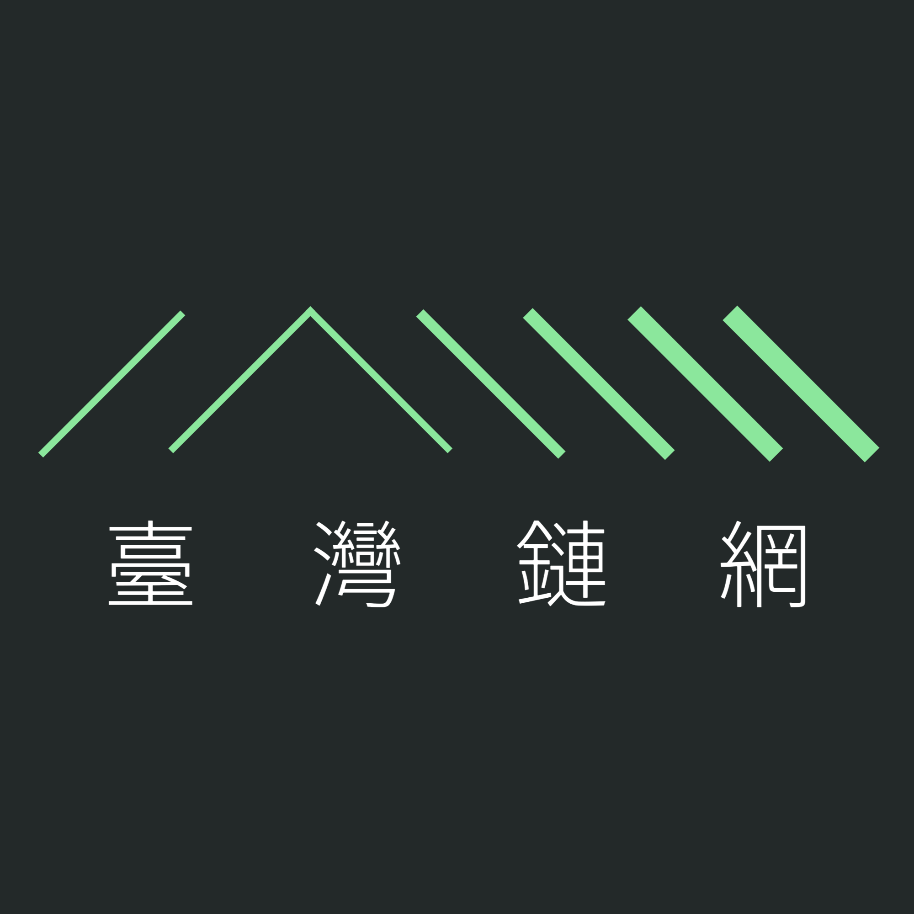
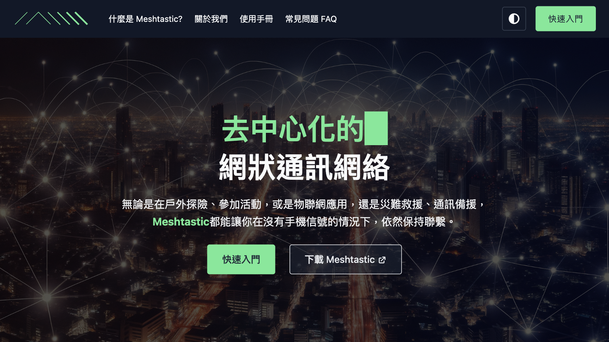
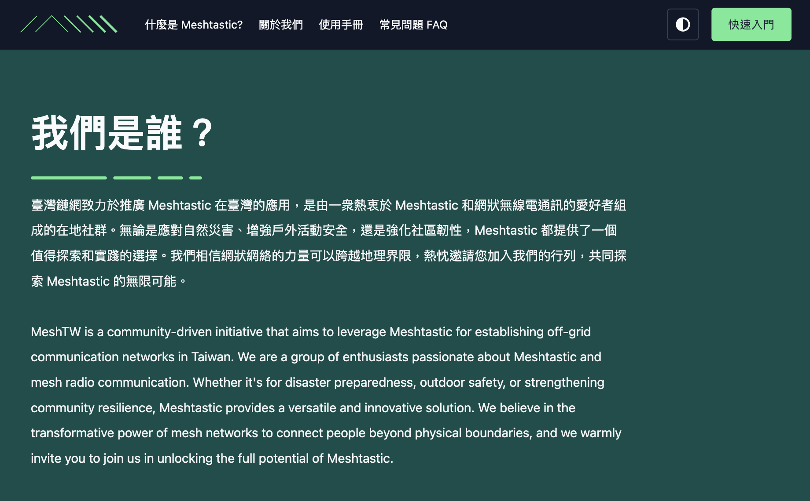
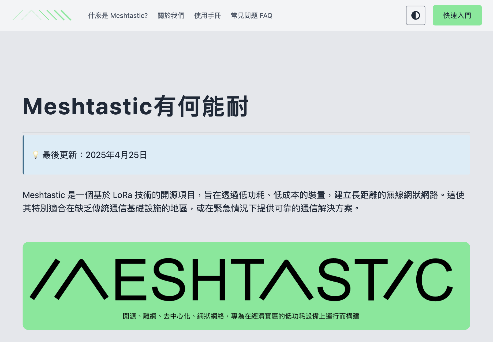
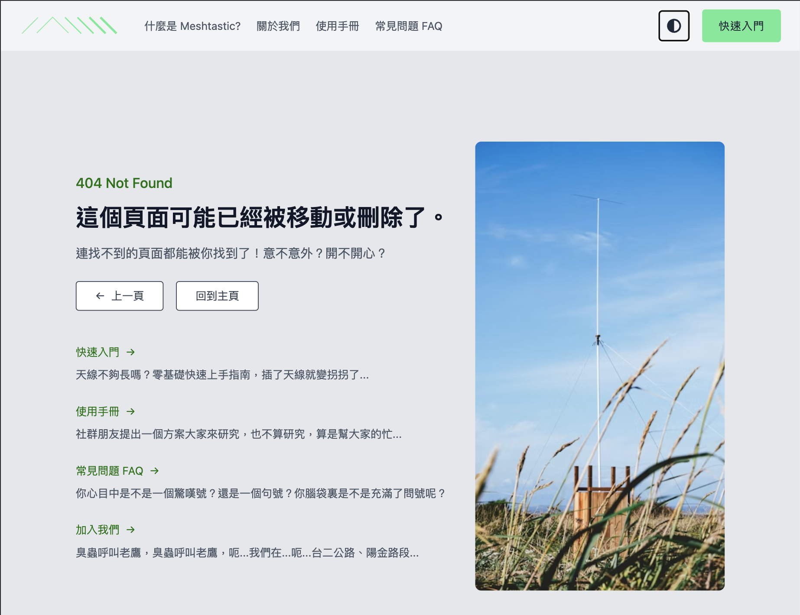

# 臺灣鏈網 Meshtastic Taiwan Community

![M-PWRD](https://img.shields.io/badge/powered-67EA94?style=for-the-badge&logo=data:image/svg+xml;base64,PD94bWwgdmVyc2lvbj0iMS4wIiBlbmNvZGluZz0iVVRGLTgiIHN0YW5kYWxvbmU9Im5vIj8+CjwhRE9DVFlQRSBzdmcgUFVCTElDICItLy9XM0MvL0RURCBTVkcgMS4xLy9FTiIgImh0dHA6Ly93d3cudzMub3JnL0dyYXBoaWNzL1NWRy8xLjEvRFREL3N2ZzExLmR0ZCI+Cjxzdmcgd2lkdGg9IjEwMCUiIGhlaWdodD0iMTAwJSIgdmlld0JveD0iMCAwIDUwIDI4IiB2ZXJzaW9uPSIxLjEiIHhtbG5zPSJodHRwOi8vd3d3LnczLm9yZy8yMDAwL3N2ZyIgeG1sbnM6eGxpbms9Imh0dHA6Ly93d3cudzMub3JnLzE5OTkveGxpbmsiIHhtbDpzcGFjZT0icHJlc2VydmUiIHhtbG5zOnNlcmlmPSJodHRwOi8vd3d3LnNlcmlmLmNvbS8iIHN0eWxlPSJmaWxsLXJ1bGU6ZXZlbm9kZDtjbGlwLXJ1bGU6ZXZlbm9kZDtzdHJva2UtbGluZWpvaW46cm91bmQ7c3Ryb2tlLW1pdGVybGltaXQ6MjsiPgogICAgPHN0eWxlPgogICAgICAgIEBtZWRpYSAocHJlZmVycy1jb2xvci1zY2hlbWU6IGRhcmspIHsKICAgICAgICAgICAgcGF0aCB7CiAgICAgICAgICAgICAgICBmaWxsOiB3aGl0ZTsKICAgICAgICAgICAgfQogICAgICAgIH0KICAgIDwvc3R5bGU+CiAgICA8ZyB0cmFuc2Zvcm09Im1hdHJpeCgxLjEwMTE2LDAsMCwwLjYzMTMyMSwtMjA3LjIyOCwtMjAyLjgzMykiPgogICAgICAgIDxnIHRyYW5zZm9ybT0ibWF0cml4KDAuMjAxODA0LDAsMCwwLjM1MTk4OSwxNjcuMjg5LDIxNi4wNjEpIj4KICAgICAgICAgICAgPHBhdGggZD0iTTI1MC45MTIsMzM0LjY2NEwxOTUuMTc1LDQxNi40MDNMMTc4Ljg4OSw0MDUuMjk3TDI0Mi43NTMsMzExLjY0QzI0NC41ODcsMzA4Ljk1IDI0Ny42MzEsMzA3LjMzOSAyNTAuODg3LDMwNy4zMzZDMjU0LjE0MywzMDcuMzMzIDI1Ny4xOSwzMDguOTM4IDI1OS4wMjksMzExLjYyNUwzMjMuMDQsNDA1LjEzNUwzMDYuNzc0LDQxNi4yN0wyNTAuOTEyLDMzNC42NjRaIi8+CiAgICAgICAgPC9nPgogICAgICAgIDxnIHRyYW5zZm9ybT0ibWF0cml4KDAuMjA1MDA5LDAsMCwwLjM1NzU3OCwxNzQuMjI0LDE1NC4yMjcpIj4KICAgICAgICAgICAgPHBhdGggZD0iTTg5Ljg3OCw1ODIuOTIzTDE1Ni45OTMsNDg0LjUwMkwxNDAuNDAyLDQ3My4xODhMNzMuMjg3LDU3MS42MDlMODkuODc4LDU4Mi45MjNaIi8+CiAgICAgICAgPC9nPgogICAgPC9nPgo8L3N2Zz4K)

<!-- markdownlint-disable -->
<!-- PROJECT LOGO -->
 

  

<h3 align="center">臺灣鏈網 MeshTW</h3>

  

    <a href="https://github.com/meshtw/meshtw.github.io/blob/docs/overview.md"><strong>Repo docs 專案説明文件 »</strong></a>
     
     
    <a href="https://meshtw.github.io/">View the Site</a>
    &middot;
    <a href="https://github.com/meshtw/meshtw.github.io/issues/new?labels=bug&template=bug-report---.md">Report Bug</a>
    &middot;
    <a href="https://github.com/meshtw/meshtw.github.io/issues/new?labels=enhancement&template=feature-request---.md">Request Feature</a>
  

<!-- markdownlint-enable -->

## 我們是誰？ Who are we?

臺灣鏈網致力於推廣 Meshtastic 在臺灣的應用，
是由一衆熱衷於 Meshtastic 和網狀無線電通訊的愛好者組成的在地社群。
無論是應對自然災害、增強戶外活動安全，還是強化社區韌性，Meshtastic 都提供了一個值得探索和實踐的選擇。
我們相信網狀網絡的力量可以跨越地理界限，熱忱邀請您加入我們的行列，共同探索 Meshtastic 的無限可能。

MeshTW is a community-driven initiative that aims to leverage Meshtastic for
establishing off-grid communication networks in Taiwan.

We are a group of enthusiasts passionate about Meshtastic and mesh radio communication.
From disaster preparedness, outdoor safety, to strengthening community resilience,
Meshtastic provides a versatile and innovative solution.

We believe in the transformative power of mesh networks to connect people beyond
physical boundaries, and we are thrilled to invite you to join us in unlocking
the full potential of Meshtastic.

## 圖呢？ Preview

## 文件 Docs

請參閲概覧[概覧](./docs/overview.md)

Please refer to [overview](./docs/overview.md).

## 授權 License

This project is licensed under the MIT License - see the LICENSE.md file for details
