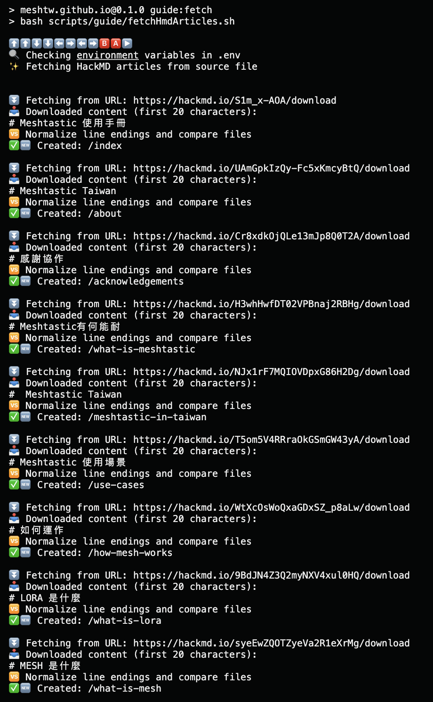
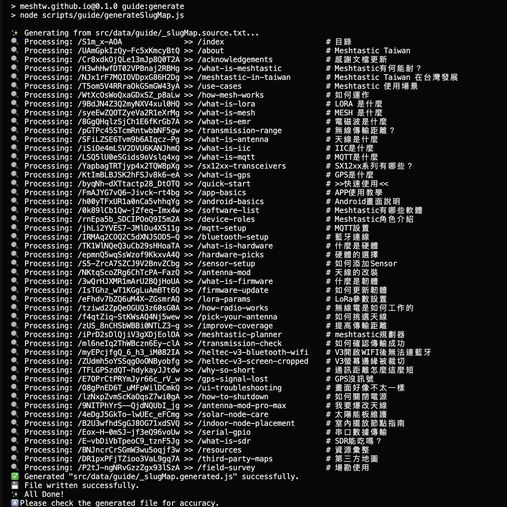

# :blue_book: Scripts and structured data 自動化腳本說明

本專案為方便開發及維護，使用自動化腳本與結構化資料達成格式轉換、 HackMD 內容同步與資料維護。

This project includes scripts and structured data for syncing, transforming, and managing HackMD-sourced content.

> :pencil2: [Meshtastic 使用手冊 on HackMD](https://hackmd.io/@fL8pq60EQsG3RplVzWfGWA/S1m_x-AOA/)

[:arrow_backward: 回到概覧 Back to Overview](./overview.md)

## :hammer_and_wrench: Scripts・腳本

> 路徑 Path: [`scripts/guide/`](../scripts/guide/)

目前自動化腳本有以下功能：

1. 取得文章
2. 生成 slug 對照表

Current functions of script files are:

1. Fetch articles
2. Generate slug mapping

### 取得文章 Fetch articles


> 路徑 Path: [`fetchHmdArticles.sh`](../scripts/guide/fetchHmdArticles.sh)

Shell Script 會根據對應表，從 HackMD 取得 Markdown 文章，並自動跳過未變更或 HTML 錯誤頁面。

The Shell script fetches articles from HackMD based on the ID–slug mapping file. Skips unchanged or HTML-error responses.



> **Usage · 使用範例**
>
> ```txt
> ./scripts/guide/fetchHmdArticles.sh [--dry-run]
> ```
>
> > _args_
> >
> > - `--dry-run` : 試運行 Dry-run

### 生成 slug 對照表 Generate slug mapping


> 路徑 Path: [`generateSlugMap.js`](../scripts/guide/generateSlugMap.js)

根據文字檔案產生對應的 slug JavaScript 模組，供路徑轉換等功能使用。

Generates the JavaScript slug map used by the site, based on the source text file.



> **Usage · 使用範例**
>
> ```txt
> node ./scripts/guide/generateSlugMap.js [--dry-run]
> ```
>
> > _args_
> >
> > - `--dry-run` : 試運行 Dry-run

## :jigsaw: NPM Scripts NPM 指令對照

| Command 指令                 | 説明                         | Description                                |
| :--------------------------- | :--------------------------- | :----------------------------------------- |
| `npm run guide:fetch`        | 從 HackMD 下載使用手冊內容   | Fetches articles from HackMD               |
| `npm run guide:fetch:dry`    | 預覽下載內容，不實際寫入檔案 | Dry-run of fetch without file writes       |
| `npm run guide:generate`     | 產生對應表                   | Generates the slug mapping JavaScript file |
| `npm run guide:generate:dry` | 試運行產生對應表             | Dry-run for checking slug mapping changes  |

## :file_folder: Data & Files 資料檔案

### 使用手冊（HackMD 鏡像）


> 路徑 Path: [`src/contents/guide/`](../src/contents/guide/)

存放從 HackMD 同步下來的使用手冊 Markdown 內容。

A place for markdown articles fetched from HackMD.

> [!NOTE]
>
> Markdown 內容為腳本自動同步，不建議手動編輯。如欲修改內容請從 HackMD 或 `_slugMap.source.txt` 着手
> 。
>
> Markdown files are auto-synced. To make changes, edit on HackMD or the source file `_slugMap.source.txt` instead.
>
> [](https://hackmd.io/@fL8pq60EQsG3RplVzWfGWA/S1m_x-AOA/)

### 資訊參照 Data mapping

> 路徑 Path: [`src/data/guide/`](../src/data/guide/)

#### 手工來源 Source File

> 路徑 Path: [`_slugMap.source.txt`](../src/data/guide/_slugMap.source.txt)

手動維護的 HackMD ID 與 slug 對應表文本。格式如下：

Manually maintained source mapping plain text between HackMD IDs and slugs. Format as follows:

```txt
note_id >> slug #title

/H3whHwfDT02VPBnaj2RBHg >> /what-is-meshtastic  # Meshtastic有何能耐？
```

#### 腳本生成對應表 Generated mapping

> 路徑 Path: [`_slugMap.generated.js`](../src/data/guide/_slugMap.generated.js)

由 `generateSlugMap.js` 腳本生成的對應表，供網站路徑轉換等功能使用。

The mapping file generated by the `generateSlugMap.js` script, used for site path conversions.

> [!CAUTION]
>
> 此檔案為自動生成，請勿手動編輯。
>
> This file is auto-generated. Do not edit manually.
